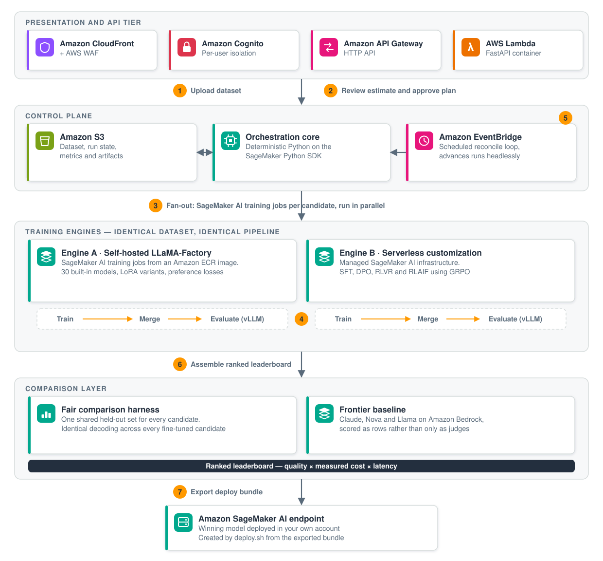

# SLM fine-tuning and evaluation platform

A deployable AWS sample that fine-tunes small open-weight language models (0.5B–20B) on your own
dataset, evaluates every candidate on the same held-out split, and ranks them on quality, measured
cost and latency next to frontier baselines called through Amazon Bedrock. Adding a model is a
catalog entry, not new training code.

- Training engine: LLaMA-Factory in one pinned Docker image with a generic SageMaker entrypoint.
  A second engine uses SageMaker serverless model customization for SFT, DPO and GRPO recipes.
- Orchestration: deterministic Python on Amazon SageMaker AI. No agent sits in the training path.
- Evaluation: offline batch inference with vLLM inside the same SageMaker job, so no inference
  endpoint is created. A finished model is merged weights in Amazon S3 plus a metrics file.
- Baselines: the same held-out split is scored by frontier models through Amazon Bedrock — Claude,
  Amazon Nova, Llama, Mistral and Command — so a fine-tuned model's measured cost sits next to a
  frontier model's actual API cost. Baseline rows carry quality and cost; latency is measured only
  for the fine-tuned candidates, which run on known instance types.
- Hosting: one `cdk deploy` puts the whole application in your account behind Amazon CloudFront
  with Amazon Cognito sign-in. The backend also runs locally against disk with no AWS account.

## What it looks like


The home page of a running deployment. Newcomers take the guided path, where an
agent profiles the dataset and proposes a ready-to-run race with its cost shown
before anything bills; everyone else takes the four-step manual path. The model
and provider counts are live and include models onboarded from Hugging Face in
that deployment, so a fresh install starts at the 30 built-in catalog entries.

## Sample code disclaimer

This repository is sample code, published for demonstration and educational purposes. It is not
intended for production use as-is and carries no service-level or support commitment. Before you
run it on anything that matters, review it against your own requirements: threat model and security
review, IAM scoping, data handling and retention, logging, availability, cost controls, and testing.
You are responsible for the security and operation of what you deploy, and for the AWS charges it
incurs. See [LICENSE](LICENSE) (MIT-0) and [SECURITY.md](SECURITY.md).

## Architecture



A dataset goes in and a ranked comparison of fine-tuned candidates comes out. Both training
engines read the same split and every candidate is scored on the same held-out set, so the
leaderboard compares models rather than harnesses. The winner is exported as a bundle you deploy
into your own account.

Everything except the AgentCore runtime is created by a single `cdk deploy` from `infra/`; the
runtime is deployed separately from `agent/`.

## The fine-tuning race

Pick several models, launch parallel SageMaker training jobs on the same split, evaluate each on the
same held-out set, and rank them. A reconcile loop advances each entry through train, eval and done
with no browser open, and picks up where it left off after a restart: EventBridge triggers the
reconcile Lambda every minute in the cloud, and an asyncio loop does the same job locally. All
entries in one race share hyperparameters, so the comparison holds.

`backend/app/cost_estimate.py` produces a lo–hi cost and duration range before a race starts. The
guided flow shows that range on an approval screen, because launching a race is the billable action.

## Model catalog and training methods

`backend/app/catalog.py` ships 30 models from 0.5B to 20B parameters across Qwen3, Qwen2.5, Llama,
Gemma, Mistral, Phi, Granite, GLM, InternLM, MiniCPM, LFM2, GPT-OSS and DeepSeek-R1-Distill. Each
entry records the model's license and whether its Hugging Face repository is gated.

The LLaMA-Factory engine supports LoRA, QLoRA, full and freeze fine-tuning, SFT, DPO (with sigmoid,
ORPO and SimPO preference losses) and KTO. The SageMaker serverless engine adds GRPO-based RLVR and
RLAIF, where the reward is a Lambda function the training loop invokes per rollout batch.

## AI agents

Three Strands agents run on one Amazon Bedrock AgentCore Runtime at the points in the workflow that
need judgment; the engine between them stays deterministic. The API Lambda invokes them
asynchronously through the worker Lambda and polls, because API Gateway caps an integration at 29
seconds.

- Investigate a dataset. After the deterministic profiler runs, the agent asks 3–6 follow-up
  questions about business context the data cannot reveal, then proposes a locked eval config. The
  question gate comes from "The Five Facets of Data Quality" (arXiv 2403.00526): the agent only asks
  about dimensions the profiler cannot resolve.
- Diagnose a failed run. Reads the failed job's log tail and config, classifies the failure, and
  proposes one fix. Advisory; you click retry.
- Recommend a model. Reads the leaderboard and your stated priorities and names a model, with the
  tradeoff against the frontier baselines quantified.

A fourth action drafts an RLAIF judge rubric and iterates on it against a real judge model under a
hard cap on judge calls. See [agent/README.md](agent/README.md) for the payload contracts.

## Repository layout

```text
backend/    FastAPI application — the platform logic
  app/main.py            API endpoints (FastAPI; Mangum adapter for Lambda)
  app/orchestrate.py     deterministic SageMaker job launch and poll
  app/race.py            parallel fine-tuning race + reconcile loop
  app/race_planner.py    picks the race entries for the guided flow
  app/catalog.py         engine-neutral model manifest
  app/render.py          manifest to LLaMA-Factory train/export YAML
  app/engines/           llama_factory and sagemaker_serverless engines
  app/baseline.py        frontier baselines via Bedrock
  app/profiler.py        deterministic dataset profiler
  app/investigator.py    AgentCore client
  app/leaderboard.py     split-scoped comparison table
  app/cost_estimate.py   pre-launch cost and duration range
  app/reward_functions.py, app/reward_deploy.py   RLVR reward Lambdas
  app/export.py, app/bundle.py   export a winner as a deployable bundle
  app/store.py           storage abstraction: local disk or S3
  app/lambda_handler.py  api / reconcile / worker Lambda entrypoints
  run-local.sh           local backend launcher
  tests/                 pytest suite; AWS mocked
agent/      Strands agent for Bedrock AgentCore Runtime
container/  Pinned LLaMA-Factory training and eval image (Dockerfile, entrypoint.sh, eval.py)
frontend/   Vite + React + TypeScript + Cloudscape single-page app
infra/      AWS CDK application (app.py, slm_platform_infra/stack.py)
docs/       architecture diagram
```

## Prerequisites

| Requirement | Version | Why |
| --- | --- | --- |
| AWS account and credentials | — | Permission to create every resource in the CDK stack |
| Region | `us-east-1` | The CloudFront-scoped WAF WebACL must live there, so `infra/app.py` pins the stack to it |
| AWS CLI | v2 | Deploy prep, Cognito user creation, CodeBuild starts |
| Node.js | 20 or newer | CDK bundles the SPA in a Node 20 image; the build uses Vite 5 |
| AWS CDK CLI | v2 (`npm install -g aws-cdk`) | `infra/requirements.txt` requires `aws-cdk-lib>=2.140,<3` — a range, not a lockfile, so two deploys can resolve different CDK versions |
| Python | 3.11 or newer | `backend/pyproject.toml` sets `requires-python = ">=3.11"` |
| Docker | running | `cdk deploy` builds the backend Lambda container image from `backend/Dockerfile` and runs `npm ci && npm run build` in a container |
| uv | current | Only for `agent/`, which has a `uv.lock`. `agent/.python-version` pins Python 3.10 |

Also needed before the platform can do real work:

- CDK bootstrap in the target account and region: `cdk bootstrap aws://<account-id>/us-east-1`.
- Amazon Bedrock model access for the baselines you intend to run. `backend/app/baseline.py` ships
  14 across Anthropic, Amazon, Meta, Mistral and Cohere; you only need access to the ones you
  select. The agent's reasoning model, `us.anthropic.claude-sonnet-4-5-20250929-v1:0`, is also
  required. Ten of the baseline ids are `us.` cross-region inference profiles, so those requests are
  served from any US region in the profile rather than staying in `us-east-1` — check that against
  your data-residency requirements before running them.
- SageMaker AI service quotas for the GPU training instances a race uses. A new account often has a
  quota of zero for `ml.g5` and `ml.g6e` training instances, and a race fails to launch without one.
- A Hugging Face account and access token if you want to fine-tune a gated base model such as Llama,
  Gemma or Mistral. You accept the publisher's license on Hugging Face; this project does not.

## Deploy

```bash
cd infra
python3 -m venv .venv
.venv/bin/python -m pip install -r requirements.txt
export PATH=".venv/bin:$PATH"

export CDK_DEFAULT_ACCOUNT="$(aws sts get-caller-identity --query Account --output text)"
export CDK_DEFAULT_REGION=us-east-1

cdk bootstrap "aws://$CDK_DEFAULT_ACCOUNT/us-east-1"    # once per account and region
cdk deploy --require-approval never --outputs-file cdk-outputs.json
```

If a stray `AWS_PROFILE` in your shell shadows the credentials the CDK Node SDK resolves, export
them explicitly first:

```bash
eval "$(aws configure export-credentials --profile <your-profile> --format env)"
unset AWS_PROFILE
```

`cdk deploy` builds the backend Lambda container image, bundles and uploads the SPA, and starts a CodeBuild
run per training-image tier. The first deploy takes roughly 8–12 minutes; the CloudFront
distribution dominates. `CloudFrontUrl` is a stack output. Other outputs you will use:
`OutUserPoolId`, `OutDataBucket`, `OutTrainingImageUri`, `OutTrainingImageBuildProject`,
`OutCostAlertTopic`.

Deploy-time options are CDK context flags; see [infra/README.md](infra/README.md) for the full list,
including the cost-alert email, the monthly budget, and an optional custom domain.

### Create the first user

The Cognito user pool is created with self-signup disabled and no users in it, so nothing can sign
in until you create an account. Using the `OutUserPoolId` output:

```bash
aws cognito-idp admin-create-user \
  --user-pool-id <OutUserPoolId> \
  --username your-name \
  --user-attributes Name=email,Value=you@example.com Name=email_verified,Value=true \
  --region us-east-1
```

The username must NOT be in email format. `stack.py` configures the pool with
`sign_in_aliases=SignInAliases(email=True, username=True)`, which makes `email` an alias attribute,
and Cognito rejects an email-shaped username on such a pool. Pass a plain username and supply the
address as the `email` attribute, as above; you can then sign in with either.

Cognito emails a temporary password and the hosted UI forces a permanent one on first sign-in. The
pool's password policy requires at least 8 characters with a lowercase letter, a digit and a symbol.
Every `/api/*` route except `/api/health` returns 401 without a valid Cognito JWT, and per-user
state isolation keys off a stable username claim — see the Security section for exactly which.

### Training images

The GPU training image is far too large for CDK Docker bundling, so a CodeBuild project builds and
pushes it to ECR. `cdk deploy` starts one build per tier automatically through a custom resource
keyed to the hash of `container/`, so it fires on the first deploy and again when the Dockerfile or
entrypoint changes. The builds run in the background, take roughly 10–20 minutes on the LARGE
compute type, and do not gate the stack. The application UI works immediately; the first training
run needs the image.

Rebuild a tier from the Docker images page in the UI, or from the CLI:

```bash
aws codebuild start-build \
  --project-name <OutTrainingImageBuildProject output> --region us-east-1
```

Two tiers ship by default, 0.9.4 (stable) and 0.9.5 (latest), each built from its own LLaMA-Factory
base. A model declares its tier through `ModelSpec.image_tag`, so a new stack lands alongside the
proven one instead of replacing it.

### Optional: Docker Hub access token

`cdk deploy` creates an ECR pull-through cache rule for Docker Hub plus a Secrets Manager secret
named `ecr-pullthroughcache/dockerhub` holding a placeholder. The training-image build prefers
pulling the LLaMA-Factory base through that cache, where the pull is authenticated and not subject
to Docker Hub's anonymous rate limit.

This is optional. Without the token the build falls back to a direct Docker Hub pull with retry and
backoff, logs a warning, and usually succeeds, but it can hit a 429 and fail. Setting the token
makes builds repeatable:

```bash
# Create a Docker Hub personal access token (Public Repo Read-only is enough), then:
# the ecr-pullthroughcache/ name prefix is required by ECR, and the value must be
# JSON with username and accessToken keys.
aws secretsmanager put-secret-value \
  --secret-id ecr-pullthroughcache/dockerhub \
  --secret-string '{"username":"<dockerhub-username>","accessToken":"<token>"}'
```

Rotating the token later is the same command with the new value. This is deploy-time infrastructure
that ECR consumes; the application never reads it, which is why it is not on the Settings page.

### Optional: Hugging Face token

For gated base models, set the token from the Settings page in the UI. It is a runtime credential,
stored per user in the `<prefix>/hf-token` secret as a JSON map keyed by Cognito `sub`, and injected
into a SageMaker job as `HF_TOKEN` at launch. Each user brings their own token and their own license
acceptance.

### Deploy the agent runtime

The AgentCore runtime is deployed by the `agentcore` CLI, not by the CDK app:

```bash
cd agent
uv sync
uv run agentcore configure --entrypoint agent.py
uv run agentcore launch
```

The runtime id gets a random suffix, so the backend resolves the ARN by the stable runtime name
`dataset_investigator` through the AgentCore control plane. Nothing needs to be wired in. Override
with `SLM_AGENT_RUNTIME_NAME`, or `SLM_AGENT_RUNTIME_ARN` for a full ARN. The runtime's execution
role needs permission to invoke the Bedrock models it uses. See
[agent/README.md](agent/README.md).

## Run locally

Two processes. The backend defaults to disk storage, so a fresh checkout runs with no AWS account
and no cloud state.

Backend on port 8000:

```bash
cd backend
python3 -m venv .venv
.venv/bin/python -m pip install -r requirements-lambda.txt "uvicorn[standard]>=0.30" pytest
./run-local.sh
```

Frontend on port 5173, proxying `/api` to port 8000:

```bash
cd frontend
npm ci
npm run dev
```

Open `http://localhost:5173`. With no `/config.json` present the SPA runs without authentication,
which is why this mode is for development only.

`run-local.sh` accepts a few environment variables:

```bash
PORT=8001 ./run-local.sh                                    # different port
AWS_PROFILE=<your-profile> ./run-local.sh                   # pick credentials
SLM_STORAGE_BACKEND=cloud SLM_S3_BUCKET=<OutDataBucket> ./run-local.sh
```

The last form points the local backend at a deployed stack's S3 state, so the local UI lists the
same datasets and runs as the hosted app. It reads and writes that state: browsing is safe, but the
action buttons mutate what the deployed app serves.

Tests:

```bash
cd backend && .venv/bin/python -m pytest tests/    # pure logic; AWS mocked
cd agent   && uv run -m pytest tests/ -q           # Bedrock mocked
```

## Cost

Deploying and using this sample creates billable AWS resources. You are responsible for all charges
in your account. Nothing below is a quote: prices differ by region and change over time, so price
each line against the [AWS Pricing Calculator](https://calculator.aws/) and the service pricing
pages before you run anything. Set a budget you are willing to lose.

GPU SageMaker training instances dominate the bill. Everything else is small by comparison.

| Service | Created or used | What drives the charge |
| --- | --- | --- |
| Amazon SageMaker AI | Training and eval jobs, launched at runtime | GPU instance time. `ml.g5.2xlarge` through `ml.g5.12xlarge` and `ml.g6e.xlarge` through `ml.g6e.12xlarge`, billed per second while a job runs. One race entry launches up to three jobs: training, eval on the held-out split, and a base-model eval. Entries run in parallel, so instance-hours multiply by the number of models in the race |
| Amazon Bedrock | Frontier baselines, agent reasoning, RLAIF judges | Input and output tokens per invocation. A baseline makes one call per eval row, so the cost scales with the size of the eval split |
| Amazon Bedrock AgentCore | The Strands agent runtime, deployed separately | Runtime consumption while an agent invocation is in flight |
| AWS CodeBuild | Three projects are created — one per image tier plus an ad-hoc builder; the two tier projects run on first deploy | LARGE compute for roughly 10–20 minutes per training-image build |
| Amazon ECR | One repository for the training image tiers, plus the pull-through cache repositories and the CDK bootstrap asset repository | Storage per GB-month. The training image is large, and two tiers are built by default |
| AWS Lambda | api, worker, reconcile | Requests and GB-seconds. The reconcile function is invoked every minute by EventBridge whether or not anything is running |
| Amazon S3 | Data bucket, SPA bucket, and the CDK bootstrap staging bucket | Storage, requests and data transfer. Fine-tuned model tarballs are the bulk of it; the staging bucket holds the Lambda image assets and the packaged `container/` source |
| Amazon CloudFront | One distribution | Requests and data transfer out |
| AWS WAF | One WebACL with two rules | Per WebACL-month, per rule-month, and per million requests inspected |
| Amazon Cognito | One user pool | Monthly active users above the free allowance |
| Amazon API Gateway | One HTTP API | Requests |
| AWS Secrets Manager | Two secrets: Hugging Face tokens and the Docker Hub token | Per secret-month, plus API calls |
| Amazon CloudWatch | Log groups for Lambda, CodeBuild and SageMaker jobs; the billing alarm; training-curve metric reads | Log ingestion and storage, alarms, and `GetMetricData` calls |
| Amazon SNS, AWS Budgets | Cost-alert topic, monthly budget | Notifications, and budgets above the free allowance |
| Amazon SES | Race-completion email, only when you configure a verified sender | Messages sent |
| Amazon Route 53, AWS Certificate Manager | Only when you deploy with `-c customDomain` | Hosted-zone queries and records |

Cost controls the stack sets up for you:

- An AWS Budgets monthly cost budget, default 500 USD, notifying at 80% and 100% of actual spend and
  100% of forecast spend. Change it with `-c monthlyBudgetUsd=<amount>`.
- A CloudWatch alarm on `AWS/Billing` `EstimatedCharges` at the same threshold.
- An SNS topic for both. Subscribe an address with `-c alertEmail=you@example.com` at deploy time, or
  add the subscription later; confirmation is a one-time manual click in the email AWS sends.
- Per-user and account-wide caps on concurrent races, set as Lambda environment variables in
  `stack.py`: 8 concurrent races and 16 models per race per user, and 40 concurrent races across all
  users.
- Managed spot training is a per-race toggle. `backend/app/cost_estimate.py` models it at roughly
  35% of on-demand.

The static per-instance hourly table in `backend/app/cost_estimate.py` is hand-maintained for
`us-east-1` and was last checked against the AWS Pricing API on the date noted in that file. Treat
it as an estimate for the approval screen, not as a price list.

No inference endpoint is part of the stack: evaluation is offline batch inference inside the
training job. The one way this sample creates an always-on billed endpoint is if you run the
generated `deploy.sh` from an export bundle, which creates a SageMaker model, endpoint config and
endpoint on `ml.g5.2xlarge` by default. That endpoint bills continuously until you delete it.

## Anonymized data collection

This sample is published as an AWS Solution with the ID `SO0363`, and it carries the two
measurement hooks that go with that. Both are configured from `infra/project_config.json` and
rendered by `infra/solution_config.py`. Neither one sends anything from the running application:
there is no telemetry call, no metrics endpoint, and no generated install identifier anywhere in the
tree.

Separately from these hooks, the application does make outbound calls in the normal course of work,
none of them telemetry: Hugging Face for model and dataset metadata and for weight downloads, and
Docker Hub (or the ECR pull-through cache) for the LLaMA-Factory base image at training-image build
time.

1. Deployment counting. `stack_description()` builds the CloudFormation stack Description as
   `(SO0363) - SLM Finetuning and Evaluation Platform. Version v1.0.0`, and `infra/app.py` passes it
   as the stack's `description`. AWS counts installs by matching stack descriptions that contain the
   parenthesised ID. What this exposes is that a stack carrying that ID and version exists in your
   account.
2. API usage attribution. `user_agent_string()` returns the fixed string
   `AWSSOLUTION/SO0363/v1.0.0`. A CDK Aspect sets it as the `USER_AGENT_STRING` environment
   variable on every Lambda function in the stack, and `backend/app/aws_clients.py` appends it
   verbatim to botocore's `user_agent_extra`, so it rides along on the AWS SDK calls those Lambdas
   make. What this exposes is that a given AWS API call in your account came from this solution at
   this version.

The suffix is a constant. It contains the solution ID and the version and nothing else: no
application data, no dataset contents, no prompts or model outputs, no user identity, no account or
resource identifiers beyond whatever the AWS API call itself already carries to the service being
called. The suffix only reaches AWS services you are calling in your own account.

Coverage is partial by construction, and `infra/slm_platform_infra/user_agent.py` documents why. The
three container Lambdas are attributed. CDK's own helper Lambdas get the variable but never read it.
The CodeBuild project that builds the training image makes its calls through the AWS CLI and is not
attributed. The AgentCore runtime is deployed outside the CDK app, so nothing sets the variable for
it; `agent/README.md` notes you can pass it at launch if you want the attribution.

### Opting out, and the conflict with forking

There is no runtime flag or context switch for this. Turning it off is a source edit in
`infra/app.py`: drop the `description=solution_config.stack_description()` argument to
`SlmPlatformInfraStack`, and remove the `Aspects.of(app).add(SolutionUserAgentAspect(...))` line.
Those are the only two call sites. The Aspect already treats an empty identity as "leave the
environment alone", and `backend/app/aws_clients.py` treats an unset `USER_AGENT_STRING` as "not
attributed" rather than an error, so nothing downstream breaks.

Blanking `solution.id` in `infra/project_config.json` is not a working opt-out.
`stack_description()` raises a `ValueError` at synth time when the ID does not produce a description
containing `(SO`, so `cdk synth` and `cdk deploy` both fail.

`project_config.json` carries a note telling forks not to edit the three `solution` fields, because
they are the join keys for the published solution's deployment and API-usage metrics. That
instruction and an opt-out pull in opposite directions, so pick deliberately:

- If you are running this sample as published and are content for the deploy to be counted against
  it, change nothing.
- If you want no attribution at all, remove the two call sites in `infra/app.py`. Leave
  `project_config.json` alone; editing the ID either breaks synth or files your deploys under an ID
  that is not yours.
- If you are shipping a derivative under your own solution ID, replace all three `solution` fields
  with your own ID, name and version. The ID must start with `SO` for `stack_description()` to
  accept it, and the two signals then point at your solution rather than this one.

## Cleanup

```bash
cd infra
cdk destroy
```

That deletes the CloudFormation stack, and with it: both S3 buckets including their objects (both
have `auto_delete_objects` set), the `<prefix>-llamafactory` ECR repository including its images
(`empty_on_delete`), the Cognito user pool and its users, the three Lambda functions, the HTTP API,
the CloudFront distribution, the WAF WebACL, the EventBridge rule, the CodeBuild projects, the
SageMaker and reward-Lambda execution roles, the SNS topic, the budget, and the billing alarm. No
resource in the stack uses `RemovalPolicy.RETAIN`. The two Secrets Manager secrets are marked for
deletion, and Secrets Manager applies its recovery window before they disappear.

`cdk destroy` does not remove the following. Check each one, because several keep costing money.

1. SageMaker endpoints you created from an export bundle. Nothing in CloudFormation knows about
   them. Delete the endpoint, the endpoint config and the model. This is the item most likely to
   still be billing you.
2. The Bedrock AgentCore runtime deployed from `agent/` by the `agentcore` CLI, along with any ECR
   repository and IAM role that CLI created. It is outside the CDK app.
3. ECR pull-through cache repositories. The cache rule itself is a stack resource and is deleted,
   but the repositories ECR creates on a cache miss, under the `docker-hub/` prefix, are not, and
   they hold the cached LLaMA-Factory base layers.
4. CloudWatch log groups. Lambda, CodeBuild and SageMaker create their own log groups on first run,
   so the stack does not declare them and they survive: `/aws/lambda/<prefix>-api`,
   `/aws/lambda/<prefix>-reconcile`, `/aws/lambda/<prefix>-worker`,
   `/aws/codebuild/<prefix>-training-image-build-*` and `/aws/sagemaker/TrainingJobs`. CDK's own
   helper functions leave their own groups as well, under
   `/aws/lambda/SlmPlatformInfra-CustomCDKBucketDeployment*`,
   `/aws/lambda/SlmPlatformInfra-CustomS3AutoDeleteObjects*` and
   `/aws/lambda/SlmPlatformInfra-AWS679f53*`.
5. SageMaker training job records. AWS has no API to delete a training job, so the history stays in
   the account. It is metadata and does not bill.
6. Reward Lambda functions named `slm-rlvr-reward-*`. `backend/app/reward_deploy.py` creates them
   with boto3 at runtime, so they are not stack resources.
7. SageMaker model package groups and the AI Registry hub content the serverless engine and the RLVR
   evaluator registration create at runtime.
8. Amazon SES email identities. The application calls `CreateEmailIdentity` to request recipient
   verification.
9. The CDK bootstrap stack, `CDKToolkit`, and its staging bucket and container-asset ECR repository,
   which hold the Lambda image assets and the packaged `container/` source. Bootstrap is shared
   across CDK apps in the account, so remove it only if nothing else uses it.

## Dataset format

One JSON object per line. Each object needs a `messages` array of `{role, content}` turns. Allowed
roles are `system`, `user`, `assistant` and `tool`, and at least one `assistant` turn is required as
the training target. A ratio split is disjoint by construction — one file is partitioned with a
seed. When you upload separate train and eval files, `assert_disjoint` in `backend/app/split.py`
compares them and refuses the split if any eval row is identical to a training row (pairwise across
all three when a validation file is supplied).

```json
{"messages":[{"role":"system","content":"..."},{"role":"user","content":"..."},{"role":"assistant","content":"..."}]}
```

Preference training (DPO, KTO) uses a second shape: the prompt turns in `messages`, plus `chosen`
and `rejected` objects. See `backend/app/validation.py`.

## UI pages

Home. Build: guided fine-tuning, submit fine-tune jobs, manage datasets. Monitor: view races, view
leaderboard. Library: model catalog, Docker images, reward functions (RLVR). Then evaluate a
fine-tuned model, Settings and Feedback.

An end-to-end pass: add and validate a dataset, optionally investigate it with the agent, submit
several models as a race, watch the runs with live loss curves and diagnose any failure, compare on
the leaderboard against the frontier baselines, then ask which model to ship.

## Security

Report a suspected vulnerability through the process in [SECURITY.md](SECURITY.md), not as a public
GitHub issue.

Points worth reviewing before you expose a deployment to anyone else:

- The Cognito user pool has self-signup disabled and starts empty. You create the first user, and
  every user after that, with `admin-create-user`. The default password policy in `stack.py` is
  deliberately permissive: 8 characters, no uppercase requirement, and no MFA.
- Per-user isolation keys off a STABLE USERNAME claim, not the Cognito `sub` — `sub` regenerates for
  external-IdP users and would orphan their data. `_stable_tenant_key` in `backend/app/tenancy.py`
  prefers a `custom:alias` claim, then `cognito:username`, then the raw `identities[0].userId`, and
  only falls back to `sub`. For an external-IdP username of the form `<IdP>_<name>` it takes the part
  after the first underscore, so two federated identities that differ only in the IdP prefix resolve
  to the SAME tenant. Isolation separates state within the shared S3 bucket; it is not a security
  boundary between accounts, and you should confirm the claim shape your IdP emits before relying
  on it.
- The WAF WebACL sets the managed `SizeRestrictions_BODY` rule to Count rather than Block, because
  that rule would reject dataset uploads over 8 KB. The FastAPI application enforces its own upload
  cap instead: `MAX_UPLOAD_BYTES` in `backend/app/main.py`, currently 100 MB.
- Several IAM statements use `resources=["*"]`. For `cloudwatch:GetMetricData` and the List actions
  such as `bedrock-agentcore:ListAgentRuntimes` that is forced — the API has no resource-level
  scoping. For `sagemaker:CreateTrainingJob` and the SESv2 actions it is a choice this sample makes,
  not a limitation: both accept resource ARNs, and the job names and sender identities are
  predictable enough to scope. The CodeBuild roles are also granted repo-level ECR actions on `"*"`.
  Each statement is commented in `stack.py`; tighten them for your environment.
- Some state is deliberately GLOBAL rather than per-user, and the isolation above does not cover it:
  `config.json` (the Settings overrides), `feedback.json` (the feedback board, including uploaded
  screenshots), `custom_models.json` (onboarded models) and `verifications.json` are shared root
  documents. Any signed-in user can read them, and the feedback board's status transitions and the
  custom-model delete are not restricted to the author. Do not put anything sensitive in a feedback
  attachment on a shared deployment.
- Executing model-repo code is OFF by default. A Hugging Face repo can ship its architecture as
  Python inside the repo (`auto_map` in `config.json`), which transformers and vLLM will run
  unsandboxed — in the training job, the eval container, and any endpoint built from an export
  bundle — under this deployment's execution role. `ModelSpec.trust_remote_code` therefore defaults
  to False, so a model onboarded from an arbitrary repo id does not get code execution just by being
  onboarded. The 30 curated catalog rows opt in explicitly, because several of them (MiniCPM4, GLM-4,
  GLM-Z1, InternLM2.5, Phi-3.5/4-mini, LFM2) cannot load otherwise. To onboard a custom model that
  needs it, set `"trustRemoteCode": true` on its stored record deliberately.
- The reward-function dry-run (`POST /api/reward-functions/try`) executes a user-supplied Python
  snippet in-process in the API Lambda. Three guards apply: an AST pass that rejects every private
  (`_`-prefixed) identifier and all non-allowlisted imports, a restricted `__builtins__` with no
  `eval`/`exec`/`open`/`getattr`, and an `__import__` that returns read-only module façades instead
  of real modules — a real module is a route back into the interpreter, since `collections._sys` is
  the `sys` module. Treat this as defence in depth rather than a proven sandbox: the API Lambda's
  role can read the Hugging Face token secret, read and write every tenant's S3 prefix, and create
  SageMaker training jobs, so the stronger design is to run the dry-run in the same throwaway
  least-privilege Lambda the deploy path already builds. Review
  `backend/app/reward_functions.py` against your own threat model before exposing a deployment.
- The data S3 bucket has a CORS rule allowing GET and PUT from any origin, for presigned uploads.
- Long backend operations run inside the API Lambda under API Gateway's 29-second integration
  timeout. Very large eval sets need the async kick-off and poll path the worker Lambda provides.

## Licenses

This project is licensed under MIT No Attribution (MIT-0). See [LICENSE](LICENSE) and
[NOTICE](NOTICE).

[THIRD_PARTY.md](THIRD_PARTY.md) lists the direct third-party dependencies and their licenses, and
explains where the exhaustive transitive list comes from.

Base model weights are not redistributed here. They are downloaded from Hugging Face at training
time under each publisher's own terms, which you must read and accept yourself. That includes the
Llama Community License, the Gemma Terms of Use, and the varying licenses across Qwen, Mistral, Phi,
Granite and the rest of the catalog. Gated repositories additionally require your own Hugging Face
token and publisher approval. Imported datasets carry their own licenses too; the import UI shows
the declared license as advisory information and does not verify it. `THIRD_PARTY.md` describes how
export handles a fine-tune of a gated base.

## Contributing

See [CONTRIBUTING.md](CONTRIBUTING.md) and [CODE_OF_CONDUCT.md](CODE_OF_CONDUCT.md). Release history
is in [CHANGELOG.md](CHANGELOG.md).
